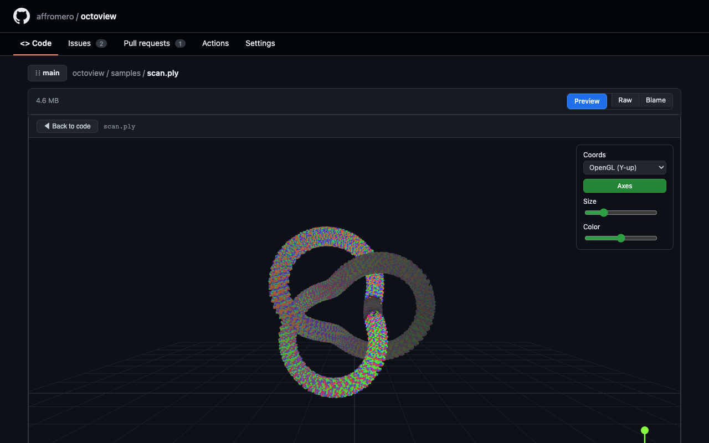
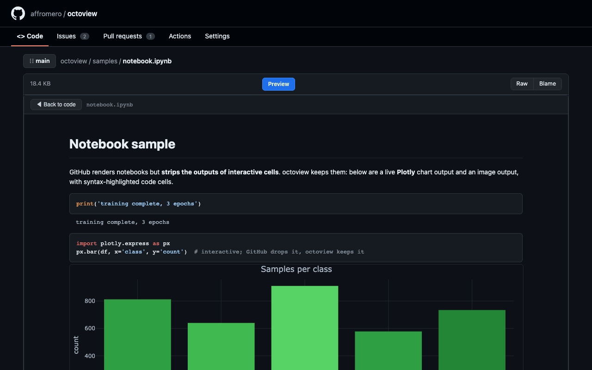
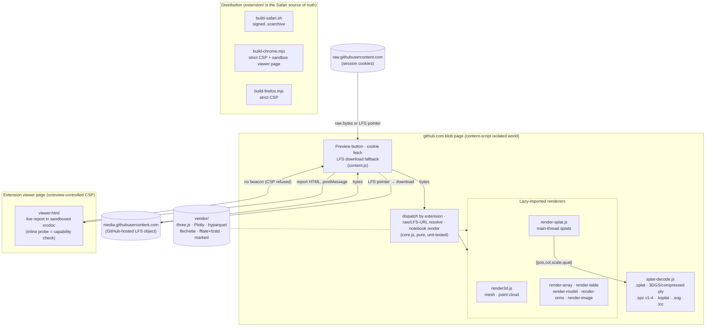

<div align="center">


# octoview

**Preview the files GitHub won't, straight from your private repos.**

_Gaussian splats, meshes, point clouds, depth and EXR, HTML reports, notebooks, tabular data. The ML and data files GitHub serves as raw bytes._

[](https://github.com/affromero/octoview/actions/workflows/ci.yml)
[](https://github.com/affromero/octoview/actions/workflows/security.yml)
[](https://github.com/affromero/octoview/actions/workflows/gitleaks.yml)
[](SECURITY.md)
[](.github/dependabot.yml)
[](LICENSE)
[](https://github.com/affromero/octoview/releases/latest)
[](test/render.e2e.mjs)
[](https://apps.apple.com/app/id6789632370)
[](https://chromewebstore.google.com/detail/octoview/oajfeecdhdnkfllcfihdjadcgbbdddem)
[](https://addons.mozilla.org/firefox/addon/octoview/)
[](https://developer.apple.com/documentation/safariservices/safari_web_extensions)
[](extension/manifest.json)
[](https://github.com/affromero/octoview/pulls)
[](CLAUDE.md)
[](https://prettier.io)
[](#develop)
[](https://threejs.org)
[](#what-it-previews)

[Why](#why) · [What it previews](#what-it-previews) · [Try it](#try-it-from-this-repo) · [How it works](#how-it-works) · [Related work](#related-work) · [Develop](#develop)

<br>


_Click **Preview** on any file GitHub serves as raw bytes. Here: a 3D Gaussian splat, orbited in place, then collapsed to its full-intensity means and back with the Variance slider._

</div>

---

## Why

ML and data work lives in files GitHub renders as **raw source or not at all**: self-contained HTML
reports ([Plotly](https://plotly.com/python/),
[`ydata-profiling`](https://github.com/ydataai/ydata-profiling),
[W&B](https://wandb.ai/) exports), notebooks whose interactive plots get stripped, Gaussian splat
captures, meshes and point clouds, model graphs, Parquet, `.npy` arrays, EXR and depth images.

The usual fixes ([`htmlpreview`](https://htmlpreview.github.io/),
[`nbviewer`](https://nbviewer.org/), [`raw.githack`](https://raw.githack.com/)) **can't reach private
repos** because they can't authenticate as you. octoview can. It is a Safari extension, so it rides
your existing GitHub session: it adds a **Preview** button on any `blob` page, fetches the file with
your cookies, and renders it in place. No service, no upload, no personal access token.

### Why in the world would someone store a splat in GitHub?

Not every splat is a city-scale capture. Small scenes, fixtures, product captures, visual regression
assets, and the exact outputs attached to an experiment or demo often belong beside the code that
created or consumes them. A repository gives those files an immutable commit, reviewable changes,
release tags, and a shared place for collaborators to fetch the same artifact.

That does not make GitHub a streaming CDN or an archive for enormous captures. Keep large or
frequently replaced scenes in object storage, releases, or an asset pipeline, and commit a stable
reference, preview image, or reduced sample instead. octoview is for the useful middle ground:
opening a real, reasonably sized asset directly from the private repository where its context lives.

## What it previews

Everything runs through one small, unit-tested core that dispatches by file extension. Each row is a
renderer. Status is **verified in WebKit (Safari's engine) by an automated render test**.

| Type                           | Extensions                                                                | Renderer                                                                                                                   | Status |
| ------------------------------ | ------------------------------------------------------------------------- | -------------------------------------------------------------------------------------------------------------------------- | :----: |
| **HTML reports / plots**       | `.html` `.htm`                                                            | extension viewer frame: the report's own scripts run, sandboxed; static fallback                                           |   ✅   |
| **Jupyter notebooks**          | `.ipynb`                                                                  | Plotly outputs render live from the MIME bundle; the rest GitHub strips is kept                                            |   ✅   |
| **3D meshes and point clouds** | `.glb` `.gltf` `.obj` `.ply` `.pcd`                                       | three.js loaders (parsed on the main thread), gizmo + point sliders                                                        |   ✅   |
| **Gaussian splats**            | `.splat` `.ply` (3DGS + compressed) `.spz` (v1-4) `.ksplat` `.sog` `.lcc` | native anisotropic WebGL2 EWA renderer (main thread, no Spark); LCC loads `index.bin` + `data.bin` from the same directory |   ✅   |
| **Model graphs**               | `.safetensors` `.gguf` `.onnx`                                            | tensor + metadata tables; ONNX gets a Netron-style SVG graph of the ops                                                    |   ✅   |
| **Tabular data**               | `.parquet` `.arrow` `.feather` `.ipc`                                     | hyparquet / flechette, sticky-header table                                                                                 |   ✅   |
| **Array previews**             | `.npy` `.npz`                                                             | viridis heatmap / RGB image, with a raw-numbers view (1-3D)                                                                |   ✅   |
| **Scientific images**          | `.exr` `.hdr` `.tif` `.tiff`                                              | tone-mapped to a canvas with an exposure slider                                                                            |   ✅   |

> **On WebKit.** Two Safari limits shape the design. (1) Renderers parse file bytes on the main
> thread (three.js loaders, pure-JS parsers) because Safari cannot fetch a main-thread `blob:` URL
> from inside a worker. (2) A report's scripts cannot run in the blob page itself: github's CSP is
> inherited by in-page frames, and Safari does not honor manifest sandbox pages. So octoview hosts
> reports in its **own extension viewer page** (the one context whose CSP it controls), inside a
> sandboxed frame where the report's scripts DO execute (opaque origin: no extension APIs, no
> cookies). If the browser refuses the relaxed extension-page CSP, the report falls back to a
> static in-page frame. Notebook Plotly outputs skip scripts entirely: their declarative MIME
> bundle renders live through octoview's own vendored Plotly. Everything octoview draws itself
> (3D, tables, arrays, images, Plotly charts) is unaffected. Every format is verified in the
> WebKit harness.

## Try it from this repo

Open any file below on GitHub and click **Preview** (after [installing](#develop)).

- **3D and Gaussian splats:** [cube.obj](samples/cube.obj) · [points.ply](samples/points.ply) · [cloud.pcd](samples/cloud.pcd) · [capybara.splat](samples/capybara.splat) · [capybara.ply](samples/capybara.ply) (compressed 3DGS) · [capybara.spz](samples/capybara.spz) · [capybara.ksplat](samples/capybara.ksplat) · [capybara.sog](samples/capybara.sog) · [butterfly.spz](samples/butterfly.spz) · [LCC bundle](samples/lcc/meta.lcc)
- **Arrays and tables:** [array.npy](samples/array.npy) · [array.npz](samples/array.npz) · [metrics.parquet](samples/metrics.parquet) · [metrics.arrow](samples/metrics.arrow)
- **Model graphs:** [model.safetensors](samples/model.safetensors) · [model.gguf](samples/model.gguf) · [model.onnx](samples/model.onnx)
- **Scientific images:** [render.hdr](samples/render.hdr) · [render.exr](samples/render.exr) · [depth.tiff](samples/depth.tiff)
- **Reports and notebooks:** [report.html](samples/report.html) · [notebook.ipynb](samples/notebook.ipynb)

<details>
<summary><b>Screenshots</b>: what Preview looks like (click to expand)</summary>
<br>

_HTML report JavaScript is live in the sandbox. Its dynamic **LIVE** badge and chart are running:_


_A Gaussian splat capture:_


_A colored point cloud:_



_Jupyter keeps the dynamic effect: the Plotly chart is interactive, while code cells are syntax-highlighted:_



_A Parquet table:_


Regenerate with `npm run screenshots` (writes store-resolution copies to `build/screenshots/`).

</details>

## How it works

Everything renders **inline in the blob view**, no new tab. Clicking **Preview** swaps the code for
the rendered file; clicking it again swaps back.

- **Private-repo access.** The content script runs on `github.com`, so it has your cookies. It
  resolves the file's tokenized `raw.githubusercontent.com` URL and fetches the bytes. When that
  response is a Git LFS pointer, octoview follows GitHub's page-provided LFS download URL instead.
  GitHub-hosted LFS files work for private repos with the existing browser session. No PAT or OAuth.
  External LFS remotes are intentionally out of scope.
- **Rendering under GitHub's CSP.** A content script runs in an isolated world that github's CSP does
  not bind, so octoview's own renderers (three.js on a `<canvas>`, DOM tables, notebook cells) run
  right there in the page. Heavy renderers (the three.js bundle) are lazy-imported only when their
  file type is opened, so normal browsing stays light.
- **Reports run live, sandboxed.** A report's own scripts cannot run in the blob page (github's CSP
  is inherited by in-page frames, and Safari does not honor manifest sandbox pages), so octoview
  frames the report inside its own extension viewer page, whose CSP it controls. There the report
  renders in a nested sandboxed frame where its scripts DO execute, in an opaque origin with no
  extension APIs, no cookies, and no GitHub DOM. The viewer's inline handshake doubles as a
  capability probe: if the browser refuses the relaxed extension-page CSP, octoview swaps in the
  static in-page frame instead.
- **Notebook Plotly charts need no scripts at all.** A Plotly output carries its chart spec as a
  declarative MIME bundle (`application/vnd.plotly.v1+json`); octoview renders it live with its own
  vendored Plotly running in the isolated world, the same CSP exemption the three.js renderers use.
- **Splats render natively — no Spark, no worker.** Gaussian splats draw with a small WebGL2
  EWA-splatting shader on the main thread, so they run in every browser with no CSP relaxation. See
  [Why not Spark](#why-not-spark) for why the obvious library doesn't fit an extension.

The dispatch, URL resolution, and notebook rendering live in
[`extension/core.js`](extension/core.js), kept free of browser APIs so they run under Vitest.

### Why not Spark

[Spark](https://sparkjs.dev) is a great Gaussian-splat renderer, but it does not fit a browser
extension. It is a ~5.7 MB WebAssembly + Web Worker library: it spins up its depth-sort worker from
a `blob:` URL and fetches its WASM from a `data:` URL. Extension pages forbid both — their CSP is
`connect-src 'none'` with no `blob:` workers, and Firefox has [WONTFIX'd blob workers in extension
pages](https://bugzilla.mozilla.org/show_bug.cgi?id=1294996) outright. So Spark silently failed to
start in **every** browser and splats degraded to an isotropic point-sprite approximation — the
see-through artifact this project used to have.

The fix was to stop treating splat rendering as a library problem. A 3D Gaussian splat is just an
oriented ellipse per point; projecting each one and alpha-blending back-to-front is ~40 lines of
WebGL2 ([EWA splatting](https://www.cs.umd.edu/~zwicker/publications/EWASplatting-TVCG02.pdf), the
antimatter15/gsplat technique). Doing it ourselves needs no worker, WASM, `eval`, or `blob:`, so it
runs under the strict extension CSP in Safari, Chrome, and Firefox alike — and drops the 5.7 MB
dependency. The trade-off: no spherical-harmonics view-dependent color, and the Spark-only `.rad`
and `.splattie` formats are no longer previewed. For a file preview, oriented gaussians are the 95%
that matters.

### Architecture



Splats render identically in every browser: `render-splat.js` draws true anisotropic
gaussians in pure WebGL2 on the main thread (in the content script's isolated world, bound
by no extension-page CSP), so there is no Spark, no worker, and no per-browser splat path.
The only remaining per-browser difference is the live-report path: Safari runs it via
`'unsafe-inline'`, Chrome via its manifest sandbox page, and Firefox (which has neither) falls
back to a static frame.

## Memory and large files

octoview does not run a background process, poll GitHub, or retain a file cache. Its content script
adds a small button on GitHub pages; the larger renderer bundles load only after you click
**Preview**.

Previews still need memory while a file is being decoded and rendered, especially for 3D assets and
scientific images. To keep that bounded, octoview limits a normal source download to **64 MiB** and
model metadata reads to **32 MiB**; those same limits apply to GitHub-hosted Git LFS downloads.
ZIP-based previews (`.npz` and `.sog`) also refuse archives whose uncompressed entries total
more than **64 MiB**. A preview in progress can be started only once, and is cancelled if you close
the preview or navigate away.

Those limits apply to source bytes, not every renderer's decoded representation: an EXR/HDR image,
for example, expands into float pixels and a canvas. Keep very high-resolution images and unusually
complex 3D scenes out of the preview path when browser memory is constrained. Gaussian-splat
previews additionally subsample to 800,000 splats and release their WebGL context when closed.

## Related work

octoview is a browser extension, so the closest comparison is other GitHub extensions. The popular ones ([Refined GitHub](https://github.com/refined-github/refined-github), [Octotree](https://www.octotree.io/), [OctoLinker](https://github.com/OctoLinker/OctoLinker), [Sourcegraph](https://sourcegraph.com/docs/integration/browser-extension)) enhance navigation or polish the UI. **None render the file's contents.**

The genuinely comparable tools are a handful of single-purpose renderers, all narrow and Chrome-only: a [Mermaid diagram renderer](https://chromewebstore.google.com/detail/mermaid-diagram-renderer/ahhjfofclhjllmiglebianajpmkabcbc) (largely superseded by GitHub's native Mermaid support), [three-hub](https://github.com/danielribeiro/three-hub) for 3D models, and an [ipynb viewer](https://chromewebstore.google.com/detail/ipynb-files-viewer/iohfdefnnffaejpacklikjbjhnfcmbej) for notebooks. None span the range octoview covers, and none ship on Safari.

### Browser support

| Browser                                                                                     | Everything except reports |   Gaussian splats    |  Live HTML reports   | Availability                                                                                    |
| ------------------------------------------------------------------------------------------- | :-----------------------: | :------------------: | :------------------: | ----------------------------------------------------------------------------------------------- |
|            |          native           | native (anisotropic) | live (unsafe-inline) | [App Store](https://apps.apple.com/app/id6789632370)                                            |
|      |          native           | native (anisotropic) | live (sandbox page)  | [Web Store](https://chromewebstore.google.com/detail/octoview/oajfeecdhdnkfllcfihdjadcgbbdddem) |
|  |          native           | native (anisotropic) |     static frame     | [AMO](https://addons.mozilla.org/firefox/addon/octoview/)                                       |

Splats and every non-report renderer behave identically across all three — they run in the content
script's isolated world with no relaxed CSP. The only difference is live HTML reports: Firefox has no
manifest sandbox-page mechanism, so a report there renders as a static frame (the same graceful
fallback Safari uses if it refuses the relaxed extension-page CSP).

### Why isn't this a PR to Refined GitHub?

It comes up, so here is the reasoning:

- **Different category of change.** Refined GitHub ships hundreds of small UI and workflow refinements and [explicitly scopes out](https://github.com/refined-github/refined-github/blob/main/contributing.md) niche features; a rendering engine for ML file formats is not a refinement, it's a product. The same applies to the file-tree and linking extensions.
- **Payload.** octoview vendors several MB of renderers (three.js, Plotly, hyparquet). Merging that into a lightweight extension would tax every user of the host extension for a feature most would never trigger.
- **Permission and CSP surface.** Rendering live reports and WASM-backed viewers requires extension viewer pages with a carefully relaxed CSP (or Chrome sandbox pages), a security surface a UI-refinement extension has no reason to carry.
- **They compose.** Extensions are not exclusive: run Refined GitHub for the workflow polish and octoview for the file rendering. That composition is the extension model working as intended, not a gap to merge away.

## Roadmap

- **Firefox listing.** The AMO-ready package builds from this repo (`npm run build:firefox`, lint-clean); what remains is the listing itself and a runtime check in Gecko (Playwright cannot drive Firefox extensions, so that check is selenium/geckodriver work).
- **More formats on demand.** LCC is supported. An LCC preview needs the `.lcc` metadata file plus its `index.bin` and `data.bin` siblings in the same GitHub directory.
- **Other browsers and new formats: PRs welcome.** The renderer interface is a single extension-keyed dispatch, so adding a format is mostly one self-contained module plus a WebKit render test. Contributions are the fastest path to wider coverage.

## Develop

No Xcode is needed for the dev loop. Safari loads the unpacked folder directly.

1. **Develop, Add Temporary Extension**, then select `extension/`.
2. Reload the page you are testing and click **Preview**. (Re-add after editing to reload.)

To package for distribution:

```sh
./scripts/build-safari.sh             # Mac App Store archive (converter + signed xcodebuild archive)
npm run build:chrome                  # Chrome variant + Web Store zip in build/
```

`extension/` is the Safari source of truth; the Chrome build patches the manifest for
Chrome's stricter MV3 CSP (no `'unsafe-inline'`, no `blob:` workers) and grants the
live-report viewer its relaxed CSP through a manifest `sandbox` page instead.

## Test

```sh
npm install
npm test                              # vitest (jsdom): core logic and renderers
npx playwright install chromium webkit
npm run test:e2e                      # renders every sample in Chromium AND WebKit (Safari's engine)
npm run test:chrome                   # loads the Chrome build into Chromium: button, live report, splat
npm run ci                            # lint, format check, unit tests
```

The e2e test is the important one. It renders each sample under the real extension CSP in **WebKit**,
which is how Safari-specific breakage that jsdom cannot see gets caught.

## Layout

```
extension/
  manifest.json        MV3 config (content scripts, web-accessible render modules)
  core.js              pure and DOM logic: dispatch, raw/LFS URL resolve, notebook render (unit-tested)
  content.js           github.com: button, cookie fetch + GitHub LFS download, inline render pane
  viewer.html          extension page hosting a report's sandboxed live frame (CSP probe + fallback)
  render3d.js          three.js mesh and point-cloud renderer (gizmo, point sliders)
  render-splat.js      native anisotropic WebGL2 splat renderer (.splat, 3DGS/compressed .ply, .spz, .ksplat, .sog, .lcc)
  render-array.js      .npy/.npz heatmap/image + raw-numbers view
  render-table.js      .parquet table (hyparquet)
  render-model.js      .safetensors/.gguf tensor and metadata table
  render-image.js      .exr/.hdr/.tiff tone-mapped to a canvas
  splat-decode.js      pure splat parsers (.splat, 3DGS/compressed .ply, .spz, .ksplat, .sog, .lcc); unit-tested
  unzip.js             shared ZIP reader (fflate) for .npz and .sog
  vendor/              self-contained libs (marked, three.js + loaders, hyparquet, fflate, plotly)
samples/               one file per type, previewable from the repo
tests/                 vitest suite over core.js
test/harness.html/.js  stand-in blob page that drives the inline render path
test/render.e2e.mjs    Chromium and WebKit render check under a github-like CSP
```

Each `render-*.js` is an ES module, lazy-imported by `content.js` only when its file type is opened.

## More from me

If octoview is useful, you might like these too:

- [**splattie**](https://github.com/affromero/splattie): generate rigged, interactive 3D Gaussian assets for the web.
- [**gitpane**](https://github.com/affromero/gitpane): a multi-repo Git workspace dashboard for the terminal.
- [**flight-finder**](https://github.com/affromero/flight-finder): a self-hosted, bring-your-own-LLM flight price tracker.
- [**kin3o**](https://github.com/affromero/kin3o): an AI-powered Lottie animation generator CLI.
- [**klogr**](https://github.com/affromero/klogr): a batteries-included structured logger for Python data/ML projects, built on Rich.
- [**pixelcache**](https://github.com/affromero/pixelcache): a versatile Python image-processing library with built-in caching over Pillow, NumPy, and PyTorch.

## License

[MIT](LICENSE) © Andres Romero
