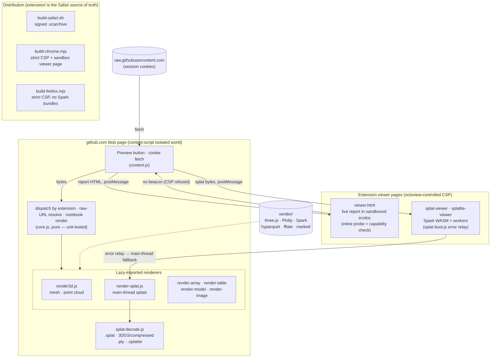

<div align="center">


# octoview

**Preview the files GitHub won't, straight from your private repos.**

_Gaussian splats, meshes, point clouds, depth and EXR, HTML reports, notebooks, tabular data. The ML and data files GitHub serves as raw bytes._

[](https://github.com/affromero/octoview/actions/workflows/ci.yml)
[](LICENSE)
[](test/render.e2e.mjs)
[](https://developer.apple.com/documentation/safariservices/safari_web_extensions)
[](extension/manifest.json)
[](https://github.com/affromero/octoview/pulls)
[](https://prettier.io)
[](#develop)
[](https://threejs.org)
[](#what-it-previews)

[Why](#why) · [What it previews](#what-it-previews) · [Try it](#try-it-from-this-repo) · [How it works](#how-it-works) · [Related work](#related-work) · [Develop](#develop)

</div>

---

## Why

ML and data work lives in files GitHub renders as **raw source or not at all**: self-contained HTML
reports ([Plotly](https://plotly.com/python/),
[`ydata-profiling`](https://github.com/ydataai/ydata-profiling),
[W&B](https://wandb.ai/) exports), notebooks whose interactive plots get stripped, Gaussian splat
captures, meshes and point clouds, model graphs, Parquet, `.npy` arrays, EXR and depth images.

The usual fixes ([`htmlpreview`](https://htmlpreview.github.io/),
[`nbviewer`](https://nbviewer.org/), [`raw.githack`](https://raw.githack.com/)) **can't reach private
repos** because they can't authenticate as you. octoview can. It is a Safari extension, so it rides
your existing GitHub session: it adds a **Preview** button on any `blob` page, fetches the file with
your cookies, and renders it in place. No service, no upload, no personal access token.

## What it previews

Everything runs through one small, unit-tested core that dispatches by file extension. Each row is a
renderer. Status is **verified in WebKit (Safari's engine) by an automated render test**.

| Type                           | Extensions                                         | Renderer                                                                           | Status |
| ------------------------------ | -------------------------------------------------- | ---------------------------------------------------------------------------------- | :----: |
| **HTML reports / plots**       | `.html` `.htm`                                     | extension viewer frame: the report's own scripts run, sandboxed; static fallback   |   ✅   |
| **Jupyter notebooks**          | `.ipynb`                                           | Plotly outputs render live from the MIME bundle; the rest GitHub strips is kept    |   ✅   |
| **3D meshes and point clouds** | `.glb` `.gltf` `.obj` `.ply` `.pcd`                | three.js loaders (parsed on the main thread), gizmo + point sliders                |   ✅   |
| **Gaussian splats**            | `.splat` `.ply` (3DGS + compressed) `.splattie`    | main-thread gaussian sprites, depth-sorted; standard and SuperSplat-compressed PLY |   ✅   |
| **Model graphs**               | `.safetensors` `.gguf`                             | main-thread header parse to a tensor + metadata table                              |   ✅   |
| **Tabular data**               | `.parquet`                                         | hyparquet, sticky-header table                                                     |   ✅   |
| **Array previews**             | `.npy` `.npz`                                      | viridis heatmap / RGB image, with a raw-numbers view (1-3D)                        |   ✅   |
| **Scientific images**          | `.exr` `.hdr` `.tif` `.tiff`                       | tone-mapped to a canvas with an exposure slider                                    |   ✅   |
| **More splats / graphs**       | `.spz` `.ksplat` `.sog` `.lcc` `.rad`, ONNX, Arrow | bespoke decoders (some Spark-only / worker-based) or Netron                        |   🚧   |

> **On WebKit.** Two Safari limits shape the design. (1) Renderers parse file bytes on the main
> thread (three.js loaders, pure-JS parsers) because Safari cannot fetch a main-thread `blob:` URL
> from inside a worker. (2) A report's scripts cannot run in the blob page itself: github's CSP is
> inherited by in-page frames, and Safari does not honor manifest sandbox pages. So octoview hosts
> reports in its **own extension viewer page** (the one context whose CSP it controls), inside a
> sandboxed frame where the report's scripts DO execute (opaque origin: no extension APIs, no
> cookies). If the browser refuses the relaxed extension-page CSP, the report falls back to a
> static in-page frame. Notebook Plotly outputs skip scripts entirely: their declarative MIME
> bundle renders live through octoview's own vendored Plotly. Everything octoview draws itself
> (3D, tables, arrays, images, Plotly charts) is unaffected. Every format is verified in the
> WebKit harness.

## Try it from this repo

Open any file below on GitHub and click **Preview** (after [installing](#develop)).

- **3D and Gaussian splats:** [cube.obj](samples/cube.obj) · [points.ply](samples/points.ply) · [cloud.pcd](samples/cloud.pcd) · [capybara.splat](samples/capybara.splat) · [capybara.ply](samples/capybara.ply) (compressed 3DGS) · [head.splattie](samples/head.splattie) · [butterfly.spz](samples/butterfly.spz)
- **Arrays and tables:** [array.npy](samples/array.npy) · [array.npz](samples/array.npz) · [metrics.parquet](samples/metrics.parquet)
- **Model graphs:** [model.safetensors](samples/model.safetensors) · [model.gguf](samples/model.gguf)
- **Scientific images:** [render.hdr](samples/render.hdr) · [render.exr](samples/render.exr) · [depth.tiff](samples/depth.tiff)
- **Reports and notebooks:** [report.html](samples/report.html) · [notebook.ipynb](samples/notebook.ipynb)

<details>
<summary><b>Screenshots</b> — what Preview looks like (click to expand)</summary>
<br>

_An HTML report rendered live — its own scripts run, sandboxed:_


_A Gaussian splat capture:_


_A colored point cloud:_


_A notebook with its interactive Plotly output kept:_


_A Parquet table:_


Regenerate with `npm run screenshots` (writes store-resolution copies to `build/screenshots/`).

</details>

## How it works

Everything renders **inline in the blob view**, no new tab. Clicking **Preview** swaps the code for
the rendered file; clicking it again swaps back.

- **Private-repo access.** The content script runs on `github.com`, so it has your cookies. It
  resolves the file's tokenized `raw.githubusercontent.com` URL and fetches the bytes. No PAT, no
  OAuth.
- **Rendering under GitHub's CSP.** A content script runs in an isolated world that github's CSP does
  not bind, so octoview's own renderers (three.js on a `<canvas>`, DOM tables, notebook cells) run
  right there in the page. Heavy renderers (the three.js bundle) are lazy-imported only when their
  file type is opened, so normal browsing stays light.
- **Reports run live, sandboxed.** A report's own scripts cannot run in the blob page (github's CSP
  is inherited by in-page frames, and Safari does not honor manifest sandbox pages), so octoview
  frames the report inside its own extension viewer page, whose CSP it controls. There the report
  renders in a nested sandboxed frame where its scripts DO execute, in an opaque origin with no
  extension APIs, no cookies, and no GitHub DOM. The viewer's inline handshake doubles as a
  capability probe: if the browser refuses the relaxed extension-page CSP, octoview swaps in the
  static in-page frame instead.
- **Notebook Plotly charts need no scripts at all.** A Plotly output carries its chart spec as a
  declarative MIME bundle (`application/vnd.plotly.v1+json`); octoview renders it live with its own
  vendored Plotly running in the isolated world, the same CSP exemption the three.js renderers use.

The dispatch, URL resolution, and notebook rendering live in
[`extension/core.js`](extension/core.js), kept free of browser APIs so they run under Vitest.

### Architecture



Per-browser reality of the two relaxed-CSP paths: Safari runs live reports via
`'unsafe-inline'` and Spark via `blob:` workers; Chrome runs live reports via its manifest
sandbox page while Spark falls back to the main-thread renderer; Firefox has neither
mechanism, so reports show the static frame and splats always render main-thread.

## Related work

octoview is a browser extension, so the closest comparison is other GitHub extensions. Nearly all of them enhance navigation or polish the UI. **None render the file's contents**, let alone ML and data formats. octoview is the one that turns a blob page into a live preview of the file itself.

| Extension                                                                 | What it adds                                                                                       | Renders file contents | Safari | Chrome | Firefox |
| ------------------------------------------------------------------------- | -------------------------------------------------------------------------------------------------- | :-------------------: | :----: | :----: | :-----: |
| **octoview** (this repo)                                                  | Inline **Preview** of the file: reports, notebooks, 3D, splats, arrays, tables, model headers, HDR |     ✅ 19 formats     |   ✅   |   ✅   |   🚧    |
| [Refined GitHub](https://github.com/refined-github/refined-github)        | Hundreds of UI and workflow refinements                                                            |          ❌           |   ✅   |   ✅   |   ✅    |
| [Octotree](https://www.octotree.io/)                                      | Collapsible file-tree sidebar                                                                      |          ❌           |  Pro   |   ✅   |   ✅    |
| [Gitako](https://github.com/EnixCoda/Gitako)                              | File-tree sidebar and fuzzy file search                                                            |          ❌           |   ❌   |   ✅   |   ✅    |
| [OctoLinker](https://github.com/OctoLinker/OctoLinker)                    | Makes `import`/`require` paths clickable                                                           |          ❌           |   ✅   |   ✅   |   ✅    |
| [Enhanced GitHub](https://github.com/softvar/enhanced-github)             | Repo and folder size, single-file download                                                         |          ❌           |   ❌   |   ✅   |   ✅    |
| [Sourcegraph](https://sourcegraph.com/docs/integration/browser-extension) | Code-intelligence hovers (go-to-def, references)                                                   |      source only      |   ✅   |   ✅   |   ✅    |
| [GitHub File Icons](https://github.com/homerchen19/github-file-icons)     | File-type icons in listings                                                                        |          ❌           |   ✅   |   ✅   |   ✅    |

The few extensions that DO render a file's contents are single-purpose and Chrome-only: a [Mermaid diagram renderer](https://chromewebstore.google.com/detail/mermaid-diagram-renderer/ahhjfofclhjllmiglebianajpmkabcbc) (largely superseded by GitHub's native Mermaid support), [three-hub](https://github.com/danielribeiro/three-hub) for 3D models, and an [ipynb viewer](https://chromewebstore.google.com/detail/ipynb-files-viewer/iohfdefnnffaejpacklikjbjhnfcmbej) for notebooks. None span the range octoview covers, and none ship on Safari.

The Firefox build (`npm run build:firefox`) is a valid, `addons-linter`-clean MV3 package, but stays 🚧 until it's listed on AMO: Gecko has no sandbox-page mechanism, so live HTML reports fall back to the static frame there (same graceful path as Safari's probe fallback), and Spark's worker cannot run, so splats always use the main-thread renderer.

### Why isn't this a PR to Refined GitHub?

It comes up, so here is the reasoning:

- **Different category of change.** Refined GitHub ships hundreds of small UI and workflow refinements and [explicitly scopes out](https://github.com/refined-github/refined-github/blob/main/contributing.md) niche features; a rendering engine for ML file formats is not a refinement, it's a product. The same applies to the file-tree and linking extensions.
- **Payload.** octoview vendors ~13 MB of renderers (three.js, Plotly, Spark, hyparquet). Merging that into a lightweight extension would tax every user of the host extension for a feature most would never trigger.
- **Permission and CSP surface.** Rendering live reports and WASM-backed viewers requires extension viewer pages with a carefully relaxed CSP (or Chrome sandbox pages) — a security surface a UI-refinement extension has no reason to carry.
- **They compose.** Extensions are not exclusive: run Refined GitHub for the workflow polish and octoview for the file rendering. That composition is the extension model working as intended, not a gap to merge away.

## Roadmap

- **Firefox listing.** The AMO-ready package builds from this repo (`npm run build:firefox`, lint-clean); what remains is the listing itself and a runtime check in Gecko (Playwright cannot drive Firefox extensions, so that check is selenium/geckodriver work).
- **More splat and graph coverage.** Promote the in-progress decoders (`.spz`, `.ksplat`, `.sog`) from experimental to verified, and add real model-graph rendering (ONNX via a Netron-style view) beyond today's tensor and metadata table.
- **Other browsers and new formats: PRs welcome.** The renderer interface is a single extension-keyed dispatch, so adding a format is mostly one self-contained module plus a WebKit render test. Contributions are the fastest path to wider coverage.

## Develop

No Xcode is needed for the dev loop. Safari loads the unpacked folder directly.

1. **Develop, Add Temporary Extension**, then select `extension/`.
2. Reload the page you are testing and click **Preview**. (Re-add after editing to reload.)

To package for distribution:

```sh
./scripts/build-safari.sh             # Mac App Store archive (converter + signed xcodebuild archive)
npm run build:chrome                  # Chrome variant + Web Store zip in build/
```

`extension/` is the Safari source of truth; the Chrome build patches the manifest for
Chrome's stricter MV3 CSP (no `'unsafe-inline'`, no `blob:` workers) and grants the
live-report viewer its relaxed CSP through a manifest `sandbox` page instead.

## Test

```sh
npm install
npm test                              # vitest (jsdom): core logic and renderers
npx playwright install chromium webkit
npm run test:e2e                      # renders every sample in Chromium AND WebKit (Safari's engine)
npm run test:chrome                   # loads the Chrome build into Chromium: button, live report, splat
npm run ci                            # lint, format check, unit tests
```

The e2e test is the important one. It renders each sample under the real extension CSP in **WebKit**,
which is how Safari-specific breakage that jsdom cannot see gets caught.

## Layout

```
extension/
  manifest.json        MV3 config (content scripts, web-accessible render modules)
  core.js              pure and DOM logic: dispatch, URL resolve, notebook render (unit-tested)
  content.js           github.com: button, fetch with cookies, inline render pane
  viewer.html          extension page hosting a report's sandboxed live frame (CSP probe + fallback)
  render3d.js          three.js mesh and point-cloud renderer (gizmo, point sliders)
  render-splat.js      main-thread Gaussian splat renderer (.splat, 3DGS/compressed .ply, .splattie)
  render-array.js      .npy/.npz heatmap/image + raw-numbers view
  render-table.js      .parquet table (hyparquet)
  render-model.js      .safetensors/.gguf tensor and metadata table
  render-image.js      .exr/.hdr/.tiff tone-mapped to a canvas
  splat-decode.js      pure splat parsers (.splat, 3DGS .ply, .splattie); unit-tested
  unzip.js             shared ZIP reader (fflate) for .npz and .splattie
  vendor/              self-contained libs (marked, three.js + loaders, hyparquet, fflate, plotly)
samples/               one file per type, previewable from the repo
tests/                 vitest suite over core.js
test/harness.html/.js  stand-in blob page that drives the inline render path
test/render.e2e.mjs    Chromium and WebKit render check under a github-like CSP
```

Each `render-*.js` is an ES module, lazy-imported by `content.js` only when its file type is opened.

## License

[MIT](LICENSE) © Andres Romero
